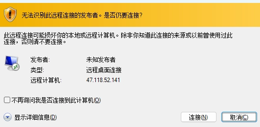
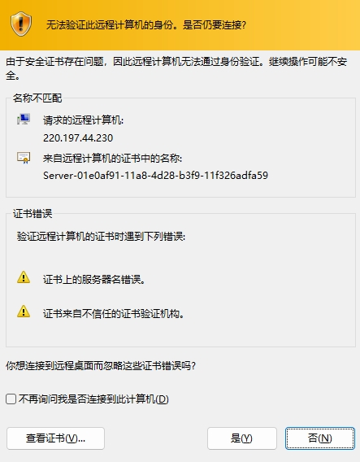
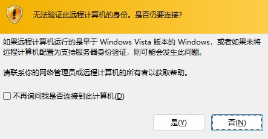
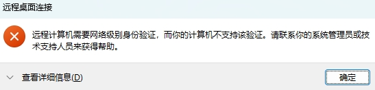
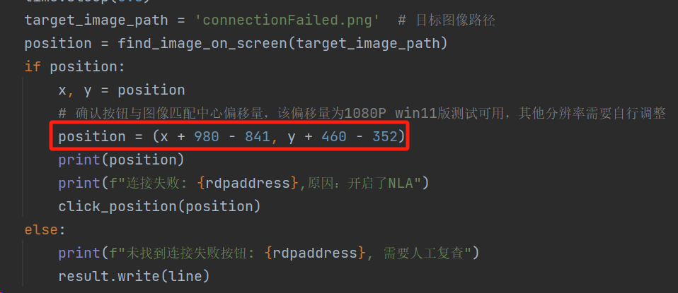

# RDP-NLA-Closing-Scanner

用于批量扫描远程桌面是否关闭NLA，而后半自动寻找搜狗输入法RCE。

经过测试网上不用mstsc.exe的方案都没法确定性的判断NLA是否开启，本工具利用图像匹配虽然效率低一点，但是准确率很高


## 使用方式

1. python安装依赖
2. 在RDPList.txt中输入RDP的连接地址，一行一个，支持三种写法：

```
Domain:port
ip:port
ip (Default Port 3389)
```

3. 修改屏幕截图和坐标偏移（默认是Win11 1080p 屏幕下的截图 和 确认坐标）









修改共计7处坐标偏移，当前逻辑为：find_image_on_screen函数匹配图像在当前屏幕在的中心点，通过计算确认按钮和中心点的偏移，确保每次都能点中选项：




## 演示视频

[](http://aaaaa.133.w21.net/showvedio.mp4)

## 原理

直接调用系统RDP-client利用配置文件关闭NLA尝试进行连接远程服务器，若远程服务器开启NLA会提示连接失败（如下图）,连接确认按钮，通过cv库截屏，进行图像匹配，利用pyauto自动点击确认按钮，而且通过cv库截屏，进行图像匹配，判断连接失败原因，并将结果保存到result.txt中。


## 免责声明

本工具仅面向合法授权的企业安全建设行为，如您需要测试本工具的可用性，请自行搭建靶机环境。

为避免被恶意使用，本项目所有收录的poc均为漏洞的理论判断，不存在漏洞利用过程，不会对目标发起真实攻击和漏洞利用。

在使用本工具进行检测时，您应确保该行为符合当地的法律法规，并且已经取得了足够的授权。请勿对非授权目标进行扫描。

如您在使用本工具的过程中存在任何非法行为，您需自行承担相应后果，我们将不承担任何法律及连带责任。

在安装并使用本工具前，请您务必审慎阅读、充分理解各条款内容，限制、免责条款或者其他涉及您重大权益的条款可能会以加粗、加下划线等形式提示您重点注意。 除非您已充分阅读、完全理解并接受本协议所有条款，否则，请您不要安装并使用本工具。您的使用行为或者您以其他任何明示或者默示方式表示接受本协议的，即视为您已阅读并同意本协议的约束。