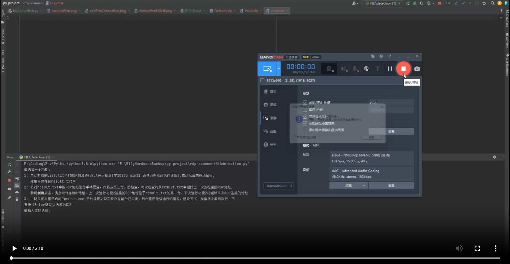

# RDP-NLA-Closing-Scanner

用于批量扫描远程桌面是否关闭NLA，而后半自动寻找搜狗输入法RCE。

经过测试网上不用mstsc.exe的方案都没法确定性的判断NLA是否开启，本工具利用图像匹配虽然效率低一点，但是准确率很高


## 使用方式

1. python安装依赖
2. 在RDPList.txt中输入RDP的连接地址，一行一个，支持三种写法：

```
Domain:port
ip:port
ip (Default Port 3389)
```


## 演示视频

[](http://aaaaa.133.w21.net/showvedio.mp4)

## 原理

直接调用系统RDP-client利用配置文件关闭NLA尝试进行连接远程服务器，若远程服务器开启NLA会提示连接失败（如下图）,连接确认按钮，通过cv库截屏，进行图像匹配，利用pyauto自动点击确认按钮，而且通过cv库截屏，进行图像匹配，判断连接失败原因，并将结果保存到result.txt中。

